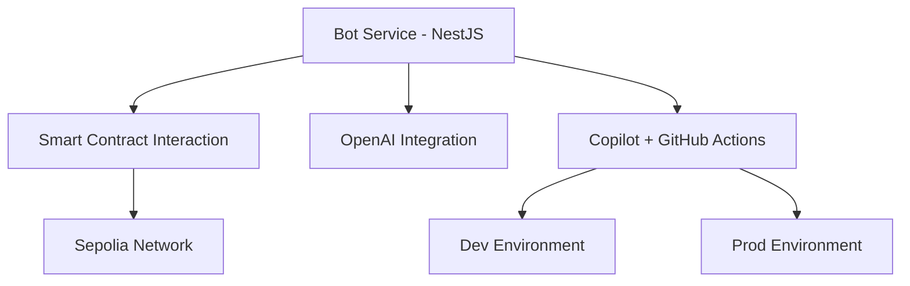

## Bot Service (NestJS)

This is a NestJS service that acts as a bot interacting with a smart contract on the Sepolia testnet. It also integrates OpenAI for enhanced features such as riddle generation or answer verification.

## Setup Instructions

### 1. Install Dependencies

```bash
npm ci
```

### 2. Environment Setup

Create a `.env` file based on the provided template:

```
BOT_PRIVATE_KEY=your_private_key
RPC_URL=https://sepolia.infura.io/v3/your_project_id
CONTRACT_ADDRESS=0xYourDeployedContract
OPENAI_API_KEY=your_openai_key
```

## Scripts

- `npm run start:dev` — Run the service in watch mode.
- `npm run lint` — Lint all project files.
- `npm run test` — Run all unit tests.
- `npm run build` — Build the NestJS application.

## Deployment

This project uses **AWS Copilot** with **GitHub Actions** for CI/CD. Two environments are already configured:

- `dev` – for staging/testing
- `prod` – for production


To deploy manually:

```bash
npm run copilot:deploy:dev
npm run copilot:deploy:prod
```

To view logs:

```bash
npm run copilot:logs:dev
npm run copilot:logs:prod
```