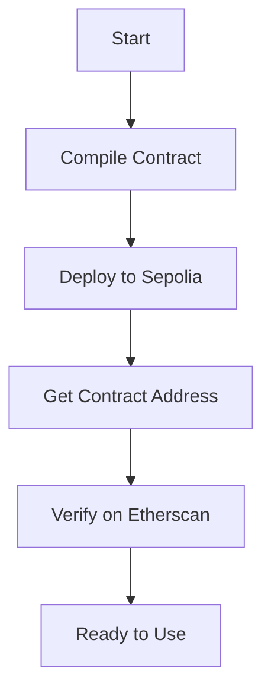

# Riddle Project – Onchain Smart Contract Challenge

A Hardhat project to deploy and verify the OnchainRiddle.sol contract on Sepolia or a local Hardhat network.

## 📄 Deployed Contracts on Sepolia

| Environment | Contract Address | Etherscan Link |
|-------------|------------------|----------------|
| Development | `0xC50FAdde64a3c08a6705182be1215a99CA2e34B5` | [View on Etherscan](https://sepolia.etherscan.io/address/0xC50FAdde64a3c08a6705182be1215a99CA2e34B5) |
| Production  | `0x6aF71B900544A28cc0c3b277A65458788f6B97E1` | [View on Etherscan](https://sepolia.etherscan.io/address/0x6aF71B900544A28cc0c3b277A65458788f6B97E1) |

## Project Structure

```bash
riddle-project/
├── contracts/
│   └── OnchainRiddle.sol
├── scripts/
│   └── deploy.ts
├── test/
│   └── OnchainRiddle.test.ts
├── tools/
│   └── artifacts-to-abis.mjs
├── .env.template
├── hardhat.config.ts
└── package.json
```

## Setup

1. Clone the repository
2. Install dependencies
3. Copy `.env.template` to `.env` and update with your credentials

```bash
cp .env.template .env
npm install
```

## .env Format

```env
WALLET_PRIVATE_KEY=0xabc123...
SEPOLIA_RPC_URL=https://...
ETHERSCAN_API_KEY=your_key_here
```

## Usage

### Compile Contracts

```bash
npm run compile
```
### Deploy to Sepolia

```bash
npm run deploy -- --network sepolia
```

### Verify on Etherscan

```bash
npx hardhat verify <DEPLOYED_CONTRACT_ADDRESS> -- --network sepolia
```

### Run a Local Node

```bash
npm run local-node
```

## Mermaid Deployment Flow



## Tests

```bash
npm run test
```

## Lint and Format

```bash
npm run lint
npm run format
```

## Extras

- `artifact-to-abis` exports contract ABIs:
  ```bash
  npm run artifact-to-abis
  ```

## Security Reminder

Do not commit your `.env` file. Only share `.env.template`.

